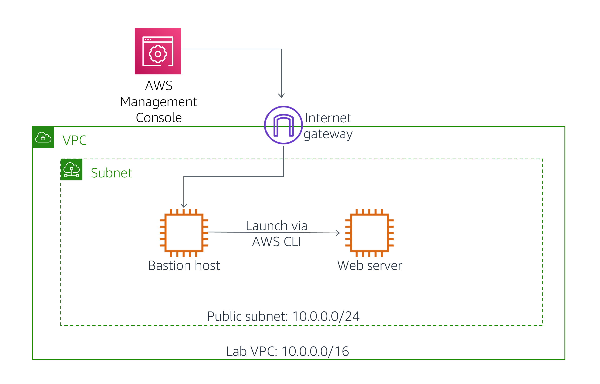

Lab - Creating Amazon EC2 Instances
Traditional methods of deploying servers and configuring security are complex and often involve multiple teams and long delays. Fortunately, it is quick and easy to deploy secure infrastructure in the cloud. As a Systems Operator, you can automate many of these processes using the AWS Command-Line Interface.

In this lab you will:

Launch an Amazon EC2 instance using the management console
Launch an Amazon EC2 instance using the AWS Command-Line Interface (AWS CLI)
The final architecture will be:



If you have time, an optional Challenge section will then have you troubleshoot some issues with Amazon EC2 instances.

Accessing the AWS Management Console
At the top of these instructions, click Start Lab to launch your lab.

A Start Lab panel opens displaying the lab status.

Wait until you see the message "Lab status: ready", then click the X to close the Start Lab panel.

At the top of these instructions, click AWS

This will open the AWS Management Console in a new browser tab. The system will automatically log you in.

Tip: If a new browser tab does not open, there will typically be a banner or icon at the top of your browser indicating that your browser is preventing the site from opening pop-up windows. Click on the banner or icon and choose "Allow pop ups."

Arrange the AWS Management Console tab so that it displays along side these instructions. Ideally, you will be able to see both browser tabs at the same time, to make it easier to follow the lab steps.

 Please do not change the Region during this lab.

 

# Task 1: Launch an Amazon EC2 Instance using the Management Console
In this task, you will launch an Amazon EC2 instance using the management console. The instance will be a Bastion Server, from which you can use the AWS Command-Line Interface (AWS CLI).

In the AWS Management Console, on the Services  menu, click EC2.
Click Launch Instances
 

## Step 1: Choose an Amazon Machine Image (AMI)
This step allows you to choose an AMI, which contains a copy of the disk volume that will be used to launch the instance.

 Examine the list of AMIs that are displayed, showing many versions of Microsoft Windows and Linux. These disk images are regularly updated to incorporate security patches and software that helps you use AWS services. You can also create your own AMI that includes your own data and applications, or you can select pre-built commercial applications from the AWS Marketplace.

Your Bastion Server will use Amazon Linux 2.

Beside the Amazon Linux 2 AMI (at the top), click Select
 

## Step 2: Choose an Instance Type
This step allows you to choose an Instance Type, which determines the resources that will be allocated to your EC2 instance. Each Instance Type allocates a combination of virtual CPUs, memory, disk storage and network performance.

Instance Types are divided into families such as Compute-optimized, Memory-optimized and Storage-Optimized. The name of the Instance Type includes a family identifier, such as t3 and m5. The number indicates the generation of the instance, so m5 is newer than m4.

Your application will use a t3.micro Instance Type, which is a small instance that can burst above baseline performance when it is busy. It is ideal for development, testing and for applications that have bursty workloads.

Select  t3.micro
Click Next: Configure Instance Details
 

## Step 3: Configure Instance Details
This step allows you to configure instance details, such as the number of instances to launch and the network configuration. You can hover over the  icons to view a description of each field.

You will launch the instance in a public subnet within the Lab VPC network.

Configure these settings:

Network: Lab VPC
Subnet: Public Subnet
IAM role: Bastion-Role
The Bastion-Role grants permission to applications running on the instance to make requests to the Amazon EC2 service. This is required for the second half of this lab, where you will use the AWS CLI to communicate with the EC2 service.

Click Next: Add Storage

 

## Step 4: Add Storage
This step can be used to add additional Amazon Elastic Block Store (EBS) disk volumes and configure their size and performance.

You can hover over the  icons to view a description of each field.

You will use the default disk size, so no changes are required.

Click Next: Add Tags
 

## Step 5: Add Tags
Tags allow you to categorize your AWS resources in different ways, such as by purpose, owner, or environment. This is useful when you have many resources of the same type — you can quickly identify a specific resource by their tags. Each tag consists of a Key and a Value, both of which you define.

Click Add Tag then configure:

Key: Name
Value: Bastion Server
This name will appear on the instance in the EC2 management console.

Click Next: Configure Security Group

 

## Step 6: Configure Security Group
You will create a new Security Group that permits SSH connections. This security group will allow you to log in to the Bastion Server via SSH.

Configure these settings:

Security group name: Bastion security group
Description: Permit SSH connections
Permissions for inbound access via SSH (port 22) have already been configured by default.

Click Review and Launch

 

## Step 7: Review Instance Launch
This step displays a summary of the configuration for the instance you are about to launch.

Click Launch

A Select an existing key pair or create a new key pair window will appear.

Select  I acknowledge that....

Click Launch Instances

Your instance will now be launched.

Click View Instances

The Bastion Server will appear in a pending state, which means it is being launched. It will then change to running, which indicates that the instance has started booting.

Wait for the Instance State to change to  running.

Select  Bastion Server.

Review the information displayed in the Description tab in the lower half of the page. It includes information about the instance type, security settings and network settings.

 

# Task 2: Log into the Bastion Server
In this task, you will log into the Bastion Server that you just created.

Copy the IPv4 Public IP (shown in the lower half of the page) to your clipboard.

 It might take a minute until the IPv4 Public IP value is displayed.

The following instructions now vary slightly depending on whether you are using Windows or Mac/Linux.

 

 ## Windows Users: Using SSH to Connect
 These instructions are for Windows users only.

If you are using macOS or Linux, skip to the next section.

Read through the three bullet points in this step before you start to complete the actions, because you will not be able see these instructions when the Details panel is open.

Click on the Details drop down menu above these instructions you are currently reading, and then click Show. A Credentials window will open.
Click on the Download PPK button and save the labsuser.ppk file. Typically your browser will save it to the Downloads directory.
Then exit the Details panel by clicking on the X.
Download needed software.

You will use PuTTY to SSH to Amazon EC2 instances. If you do not have PuTTY installed on your computer, download it here.
Open putty.exe

Configure PuTTY to not timeout:

Click Connection
Set Seconds between keepalives to 30
This allows you to keep the PuTTY session open for a longer period of time.

Configure your PuTTY session:

Click Session
Host Name (or IP address): Paste the IPv4 Public IP value you copied to your clipboard earlier in the lab.
Back in PuTTy, in the Connection list, expand  SSH
Click Auth (don't expand it)
Click Browse
Browse to and select the lab#.ppk file that you downloaded
Click Open to select it
Click Open
Click Yes, to trust the host and connect to it.

When prompted login as, enter: ec2-user

This will connect you to the EC2 instance.

Windows Users: Click here to skip ahead to the next task.


 

## Mac  and Linux  Users
These instructions are for Mac/Linux users only. If you are a Windows user, skip ahead to the next task.

Read through the three bullet points in this step before you start to complete the actions, because you will not be able see these instructions when the Details panel is open.

Click on the Details drop down menu above these instructions you are currently reading, and then click Show. A Credentials window will open.
Click on the Download PEM button and save the labsuser.pem file.
Then exit the Details panel by clicking on the X.
Open a terminal window, and change directory cd to the directory where the labsuser.pem file was downloaded.

For example, run this command, if it was saved to your Downloads directory:
```
cd ~/Downloads
```
Change the permissions on the key to be read only, by running this command:
```
chmod 400 labsuser.pem
```
Return to the terminal window and run this command (replace <public-ip> with the IPv4 Public IP value you copied to your clipboard earlier in the lab):
```
ssh -i labsuser.pem ec2-user@<public-ip>
```
Type yes when prompted to allow a first connection to this remote SSH server.

Because you are using a key pair for authentication, you will not be prompted for a password.


Now that you are connected to the Bastion Server, you can use the AWS CLI to call AWS services.

 

# Task 3: Launch an Instance using the AWS CLI
In this task, you will launch an Amazon EC2 instance using the AWS Command-Line Interface (CLI). The AWS CLI makes it easy to automate the provision and configuration of AWS resources.

The new instance will be configured as a Web Server.

 

## Obtain the AMI to Use
One of the parameters required when launching an instance is the Amazon Machine Image (AMI), which will populate the boot disk of the instance. AMIs are continually patched and updated by AWS, so it is recommended to always use the latest AMI when launching instances.

You will use the AWS Systems Manager Parameter Store to obtain the ID of the most recent Amazon Linux 2 AMI. AWS maintains a list of standard AMIs in the Parameter Store, making this task easy to automate.

Paste this script into your PuTTY/ssh session:

## Set the Region
```
AZ=`curl -s http://169.254.169.254/latest/meta-data/placement/availability-zone`
export AWS_DEFAULT_REGION=${AZ::-1}
```
## Obtain latest Linux AMI
```
AMI=$(aws ssm get-parameters --names /aws/service/ami-amazon-linux-latest/amzn2-ami-hvm-x86_64-gp2 --query 'Parameters[0].[Value]' --output text)
echo $AMI
```
This command did the following:
    

## Obtained the Region where the instance is running

Called the AWS Systems Manager (ssm) and used the get-parameters command to retrieve a value from the Parameter Store
The AMI requested was for Amazon Linux 2 (amzn2-ami)

The AMI ID has been stored in an Environment Variable called AMI

 If your SSH session disconnects, it will lose the information stored in environment variables. Once you reconnect, you will need to re-run all of the steps in this task, starting with the above commands to obtain the AMI ID.

 

## Obtain the Subnet to Use
You will be launching the new instance in the Public Subnet. When launching an instance, the SubnetId can be specified.

The following command will retrieve the SubnetId for the Public Subnet:

Paste this command:
```
SUBNET=$(aws ec2 describe-subnets --filters 'Name=tag:Name,Values=Public Subnet' --query Subnets[].SubnetId --output text)
echo $SUBNET
```
		This uses the AWS CLI to retrieve the Subnet ID of the subnet named Public Subnet.

 

## Obtain the Security Group to Use
A Web Security Group has been provided as part of this lab, which allows inbound HTTP requests.

Paste this command:
```
SG=$(aws ec2 describe-security-groups --filters Name=group-name,Values=WebSecurityGroup --query SecurityGroups[].GroupId --output text)
echo $SG
```
		The command retrieves the Security Group ID of the Web Security Group.

 

## Download a User Data script
You will be launching an instance that will act as a Web Server. To install and configure the web server, you will provide a User Data script that will be automatically run when the instance launches.

Paste this command to download the User Data script:
```
wget https://aws-tc-largeobjects.s3.us-west-2.amazonaws.com/CUR-TF-100-RESTRT-1/171-lab-JAWS-create-ec2/s3/UserData.txt
```
Paste this command to view the contents of the script:
```
cat UserData.txt
```
The script does the following:

- Installs a web server
- Downloads a zip file containing the web application
- Installs the web application
 

## Launch the Instance
You now have all the necessary information require to launch the Web Server instance!

Paste this command:
```
INSTANCE=$(\
aws ec2 run-instances \
--image-id $AMI \
--subnet-id $SUBNET \
--security-group-ids $SG \
--user-data file:///home/ec2-user/UserData.txt \
--instance-type t3.micro \
--tag-specifications 'ResourceType=instance,Tags=[{Key=Name,Value=Web Server}]' \
--query 'Instances[*].InstanceId' \
--output text \
)
echo $INSTANCE
```
The command launches a new instance (run_instances) using these parameters:

Image: Uses the AMI value obtained earlier from the Parameter Store
Subnet: Specifies the Public Subnet obtained earlier and, by association, the VPC in which to launch the instance

Security Group: Uses the Web Security Group obtained earlier, which permits HTTP access
User Data: References the User Data script you downloaded, which installs the web application
Instance Type: Specifies the type of instance to launch
Tags: Assigns a Name tag with the value of Web Server
The query parameter specifies that the command should return the Instance ID once the instance is launched.

The output parameter specifies that the output of the command should be in text. Other output options are json and table.

The ID of the new instance has been stored in the INSTANCE environment variable.

 

## Wait for the Instance to be Ready
You can monitor the status of the instance via the Management Console, but you can also query the status via the AWS CLI.

Paste this command:
```
aws ec2 describe-instances --instance-ids $INSTANCE
```
All information related to the instance will be displayed in JSON format. Amongst this information is the instance status.

Specific information can be obtained by using the query parameter.

Paste this command:
```
aws ec2 describe-instances --instance-ids $INSTANCE --query 'Reservations[].Instances[].State.Name' --output text
```
This is the same command but, rather than displaying all information about the instance, only displays the name of the instance State.

This will display a status of pending or running.

Repeat the above command until it returns a status of running.

 

## Test the Web Server
You can now test that the web server is working. You can retrieve a URL to the instance via the AWS CLI.

Paste this command:
```
aws ec2 describe-instances --instance-ids $INSTANCE --query Reservations[].Instances[].PublicDnsName --output text
```
This returns the DNS Name of the instance.

Copy the DNS name that is displayed.

It should look similar to: ec2-35-11-22-33.us-west-2.compute.amazonaws.com

Paste the DNS name into a new web browser tab, then press Enter.

A web page should be displayed, demonstrating that the web server was successfully launched and configured.

You can also see the instance in the EC2 management console.

Return to the web browser tab containing the EC2 management console.

Click  Refresh.

The list should now include the Web Server instance that was launched via CLI command.

As seen in this task, the AWS CLI makes it possible to programmatically access and control AWS services. These commands can be placed in a script and run as a standard process to deploy consistent, reliable infrastructure with minimal scope for human error.

Which method should you use?

- Launch from the management console when you quickly need to launch a one-off or temporary instance.
- Launch via a script when you need to automate the creation of an instance in a repeatable, reliable manner.
- Launch via CloudFormation when you wish to launch related resources together.
 

# Challenge 1: Connect to an Amazon EC2 Instance
 This challenge is optional and is provided in case you still have lab time remaining.

In this challenge, your mission is to troubleshoot an instance called Misconfigured Web Server:

## Your tasks are:

- Obtain the DNS name of the Misconfigured Web Server
- Try to establish an SSH connection to the instance
- Diagnose why this does not work and fix the misconfiguration
- At the end of the lab, your instructor will ask you:

## What was the problem?
## What did you do to fix the problem?
 

# Challenge 2: Fix the Web Server Installation
In this challenge, your mission is to troubleshoot the the web server installation on the Misconfigured Web Server:

Your tasks are:

- Point your web browser to the public IP address of the Misconfigured Web Server
- Why does the web site not appear?
- Diagnose the problem and try to fix it on the instance, or use Launch More Like This to launch another instance with a fixed configuration
- At the end of the lab, your instructor will ask you:

## What was the problem?
## What did you do to fix the problem?
 

# Lab Complete
 Congratulations! You have completed the lab.

Click End Lab at the top of this page and then click Yes to confirm that you want to end the lab.  

A panel will appear, indicating that "DELETE has been initiated... You may close this message box now."

Click the X in the top right corner to close the panel.

 

# Additional Resources
- For more information about AWS Training and Certification, see https://aws.amazon.com/training/.
- Your feedback is welcome and appreciated.
- If you would like to share any suggestions or corrections, please provide the details in our AWS Training and Certification Contact Form.
© 2022 Amazon Web Services, Inc. and its affiliates. All rights reserved. This work may not be reproduced or redistributed, in whole or in part, without prior written permission from Amazon Web Services, Inc. Commercial copying, lending, or selling is prohibited.
