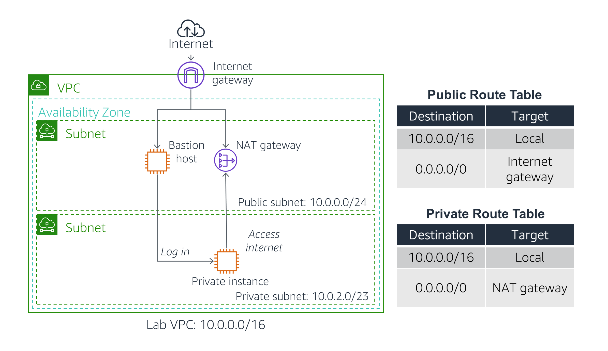

# Lab - Configure VPC
## Lab Overview
Traditional networking is hard — it involves equipment, cabling, complex configurations and specialist skills. Fortunately, Amazon VPC hides the complexity while making it easy to deploy secure private networks.

This lab shows you how to build your own Virtual Private Cloud and deploy resources.

The lab will demonstrate how to:

- Create a Virtual Private Cloud (VPC) that contains a private and public subnet, an Internet Gateway (IGW), and a Network Translation (NAT) Gateway.
- Configure Route Tables associated with a public subnet for internet-bound traffic to be directed to the IGW for direct internet access.
- Configure Route Tables associated with a private subnet for isolated resources to securely connect to the internet through a NAT Gateway.
- Launch a Bastion Host in a public subnet for resource-based secured access to the private subnet.
- Evaluate the operation of the private subnet's ability to communicate with the internet.



## Task 1: Create a VPC
## Task 2: Create Subnets
- Create a Public Subnet
- Create a Private Subnet

## Task 3: Create an Internet Gateway

## Task 4: Configure Route Tables

## Task 5: Launch a Bastion Server in the Public Subnet

## Task 6: Create a NAT Gateway

## Launch an Instance in the Private Subnet

## Launch an Instance in the Private Subnet
User Data (Under  Advanced Details): Paste this script:
```
#!/bin/bash
# Turn on password authentication for lab challenge
echo 'lab-password' | passwd ec2-user --stdin
sed -i 's|[#]*PasswordAuthentication no|PasswordAuthentication yes|g' /etc/ssh/sshd_config
systemctl restart sshd.service
```
## Log into the Bastion Server :: use PuTTY to SSH to Amazon EC2 instances

## Log into the Private Instance :: Using SSH to Connect
```
ssh PRIVATE-IP
```
- If you are prompted with "Are you sure", enter: yes
- When prompted for a password, enter: lab-password

## Test the NAT Gateway
```
ping -c 3 amazon.com
```
You should see a result similar to:
```
PING amazon.com (176.32.103.205) 56(84) bytes of data.
64 bytes from 176.32.103.205 (176.32.103.205): icmp_seq=1 ttl=220 time=63.1 ms
64 bytes from 176.32.103.205 (176.32.103.205): icmp_seq=2 ttl=220 time=62.7 ms
64 bytes from 176.32.103.205 (176.32.103.205): icmp_seq=3 ttl=220 time=62.6 ms
```
