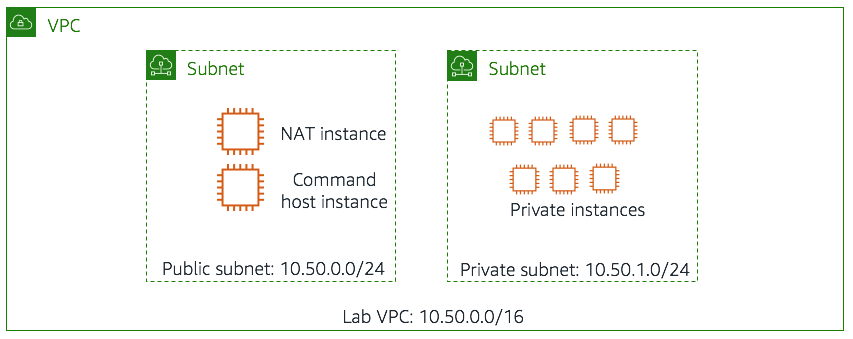

## Scenario

### The environment for this lab (pictured below) consists of:

- Amazon VPC named Lab VPC
- Public subnet
- Private subnet
- Amazon EC2 Linux instance named CommandHost [AWS Command Line Interface (CLI) tools have been pre-installed and configured for you on this instance]
- 8 Amazon EC2 Linux instances
- Private instances have three custom tags applied to them:

:: Tag Name	:: content

* :: Project	:: The project that the instance belongs to. The instances in this lab belong to one of two projects: ERPSystem and Experiment1.
* :: Version ::	The version of the project that this instance belongs to. All Version tags are currently set to 1.0.
* :: Environment ::	One of three values: development, staging, or production.

In the Task portion of this lab, you will log in to the Command Host and run some commands to find and change the Version tag on all development instances. You will run several examples that show how you can use the JMESPath syntax supported by the AWS CLI --query option to return richly formatted output. You will then use a set of pre-provided scripts to stop and re-start all instances that are tagged as belonging to the development environment.


### Find all instances in your account that are tagged with a tag of Project and a value of ERPSystem:
```
aws ec2 describe-instances \
--filter "Name=tag:Project,Values=ERPSystem"
```
The command should output the full set of parameters available for all seven instances that are tagged Project=ERPSystem. 

### Use the --query parameter to limit the output of the previous command to only the instance ID of the discovered instance:
```
aws ec2 describe-instances \
--filter "Name=tag:Project,Values=ERPSystem" \
--query 'Reservations[*].Instances[*].InstanceId'
```
Your output entries will now consist of a list of instance IDs:
```
[ 
[
"i-135b491e" 
], 
[ 
"i-3e584a33" 
], 
… 
]
```
### To include both the instance ID and the Availability Zone of each instance in your return result:
```
aws ec2 describe-instances \
--filter "Name=tag:Project,Values=ERPSystem" \
--query 'Reservations[*].Instances[*].{ID:InstanceId,AZ:Placement.AvailabilityZone}'
```

### To include the value of the Project tag in your output:
```
aws ec2 describe-instances \
--filter "Name=tag:Project,Values=ERPSystem" \
--query 'Reservations[*].Instances[*].{ID:InstanceId,AZ:Placement.AvailabilityZone,Project:Tags[?Key==`Project`] | [0].Value}'
```
Your output now includes the value of the Project tag:
```
[[{ 
"Project": "ERPSystem", 
"AZ": "us-west-2a", 
"ID": "i-3250b838" 
}],
…
]
```
#### The value of a specific named tag can be retrieved via a JMESPath query, using the following syntax:
```
Tags[?Key==\`Project\`] | [0].Value
```

### to also include the Environment and Version tags in your output:
```
aws ec2 describe-instances \
--filter "Name=tag:Project,Values=ERPSystem" \
--query 'Reservations[*].Instances[*].{ID:InstanceId,AZ:Placement.AvailabilityZone,Project:Tags[?Key==`Project`] | [0].Value,Environment:Tags[?Key==`Environment`] | [0].Value,Version:Tags[?Key==`Version`] | [0].Value}'
```
The results will give you a fuller picture of the instances currently associated with the project named ERPSystem:
```
[[{ 
"Environment": "production", 
"Project": "ERPSystem", 
"Version": "1.0", 
"AZ": "us-west-2a", 
"ID": "i-3250b838" 
}], 
… 
]
```
### Finally, add a second tag filter to see only the instances associated with the project named ERPSystem that belong to the Environment named development:
```
aws ec2 describe-instances \
--filter "Name=tag:Project,Values=ERPSystem" "Name=tag:Environment,Values=development" \
--query 'Reservations[*].Instances[*].{ID:InstanceId,AZ:Placement.AvailabilityZone,Project:Tags[?Key==`Project`] | [0].Value,Environment:Tags[?Key==`Environment`] | [0].Value,Version:Tags[?Key==`Version`] | [0].Value}'
```
You should see only two instances returned by this command, both with a Project tag value of ERPSystem and an Environment tag value of development:
```
[[{ 
"Environment": "development", 
"Project": "ERPSystem", 
"Version": "1.0", 
"AZ": "us-west-2a", 
"ID": "i-9552ba9f" 
}], 
… 
]
```

## Changing Version Tag for Development Process
run this command
```
./change-resource-tags.sh
```
### To verify that the version number on these instances has been incremented and that other non-development boxes in the ERPSystem project have been unaffected:
```
aws ec2 describe-instances \
--filter "Name=tag:Project,Values=ERPSystem" \
--query 'Reservations[*].Instances[*].{ID:InstanceId, AZ:Placement.AvailabilityZone, Project:Tags[?Key==`Project`] |[0].Value,Environment:Tags[?Key==`Environment`] | [0].Value,Version:Tags[?Key==`Version`] | [0].Value}'
```
